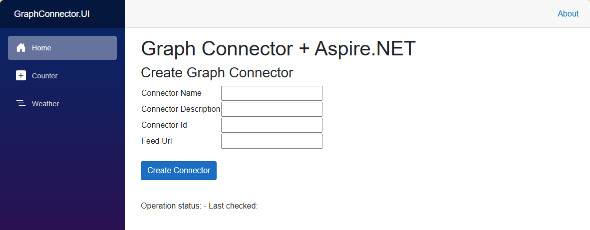

# Graph Connector + .NET Aspire

This project is designed to showcase the development of a Graph Connector using .NET Aspire to orchestrate the various components.

## Overview

This is a sample project that demonstrates how to build a custom Graph Connector using .NET Aspire and a microservices approach. The sample implementation enables to ingest into a Microsoft 365 tenant the content indexed by an RSS feed. Thanks to a simple UI application created with Blazor, you can provide all the important information and then let the application do the rest.

## Components

The solution is made by the following components:

- A RabbitMQ message broker
- A Web API in .NET, which exposes the endpoints that are used to create and retrieve messages from the queues.
- A worker service, which retrieve the messages from the queues and trigger the various operations to create the Graph Connector (create the connection, create the schema, upload the content).
- A Blazor application, which is used to provide the information needed to create the Graph Connector. The Blazor application calls the Web API to trigger the various operations.

.NET Aspire is the technology that orchestrates the various components.

## Requirements

- Visual Studio 2022 or Visual Studio Code with the [C# Dev Kit extension](https://marketplace.visualstudio.com/items?itemName=ms-dotnettools.csdevkit)
- .NET 8.0 SDK
- Docker Desktop

## Getting Started

To get started with Graph Connector + .NET Aspire, follow these steps:

1. Clone the repository.
2. Open the **GraphAspireSolution** in Visual Studio 2022 or Visual Studio Code.
3. Open a terminal and run the **setup.ps1** script. This script will use the Microsoft 365 CLI to create the Microsoft Entra app required by the Microsoft Graph APIs and it will store the credentials into the **appsettings.json** file of the **GraphConnector.Service.Queue** project.
4. Launch Docker Desktop.
5. Run the **GraphConnectorAspire.AppHost** project. This will launch the .NET Aspire dashboard.
6. From the dashboard, open the endpoint of the project called **graphconnector-ui**. The URL should be **https://localhost:7154/**.

    

7. From the main page of the application, provide the required information to create the Graph Connector:
    * Name
    * Description
    * Unique identifier
    * URL of the RSS feed
  
8. Click on **Create connector** to trigger the creation process. The application will show the status of the operation and, once it's completed, you will find the connector in the Microsoft 365 admin center, under **Settings -> Search & Intelligence -> Data sources**.

## Documentation

For more information about Graph Connectors and .NET Aspire, please refer to the following documentation:

- [.NET Aspire](https://learn.microsoft.com/dotnet/aspire/get-started/aspire-overview)
- [Graph Connectors](https://learn.microsoft.com/graph/connecting-external-content-connectors-overview)
- [The Developer's Cantina blog](https://www.developerscantina.com/)

## Contributing

We welcome contributions from the community! If you would like to contribute to Graph Connector Aspire, please follow our [Contribution Guidelines](./CONTRIBUTING.md).

## License

Graph Connector Aspire is licensed under the [MIT License](./LICENSE).
